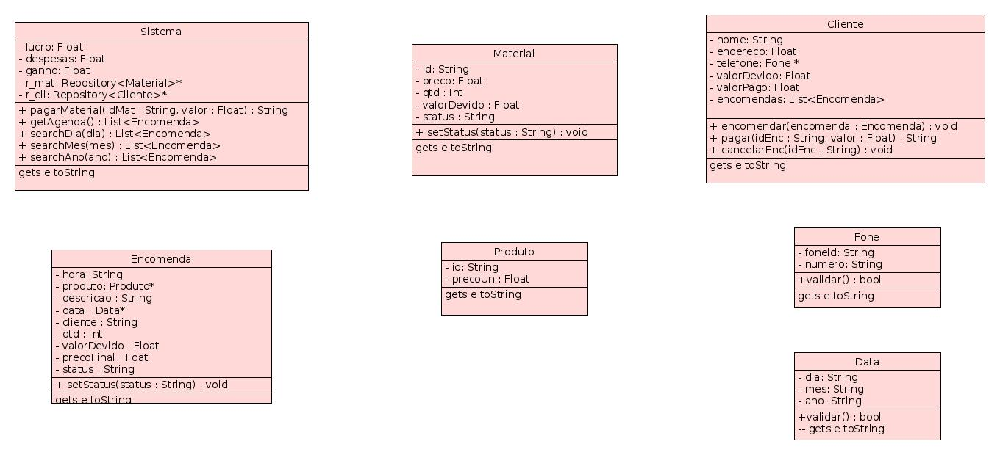

# Sistema de gerenciamento da Delícias da Branca


Sistema que gerencia uma confeitaria

---

- Clientes podem ser adicionados ao sistema e devem ter id único, telefone (com id do numero) e numero e endereço.
- O cliente pode realizar encomendas de bolos e salgados.
.

```
addCli joao 88 1234 rua1
  Cliente adicionado
addCli maria 85 8909 rua2
  Cliente adicionado

```
- O sistema deve cadastrar tamanho dos bolos e tipos de salgados, com seus respectivos precos unutários.


```
addPro boloPequeno 25
	Adicionado
addPro boloMedio 60
	Adicionado
addPro salgadosVariados 1
	Adicionado
```
- O sistema deve cadastrar os materias usados, com a quantidade e o preço.


```
addMat farinha 10 100
	Material dicionado
addPro pastaAmericana 6 200
	Material adicionado
addPro manteiga 1 30
	Material adicionado
```
- O cliente pode relizar uma encomenda de bolos ou salgados, com a data, a hora de buscar, o produto, a descrição e a quantidade.


```
encomendar joao 22 12 2017 18:00 boloPequeno unicornio 1
	Encomenda realizada
encomendar joao 22 12 2017 18:00 salgadosVariados salgados 100
	Encomenda realizada
encomendar maria 24 12 2017 19:00 boloMedio natal 2
	Encomenda realizada
encomendar maria 22 12 2017 19:00 salgadosVariados salgados 200
	Encomenda realizada
encomendar maria 22 12 2017 19:00 Torta chocolate 1
	Torta não existe
encomendar ray 12 12 2017 17:00 boloMedio chocolate 1
	Cliente ray não existe
    
```
- O cliente paga as encomendas.


```
pagarEncomenda joao boloMedio 60
	Devendo: 60.00
pagarEncomenda maria salgadosVariados 60
	Troco: 140.00  
pagarEncomenda joao boloPequeno 25
	Troco: 0.00

```
- O cliente pode cancelar uma encomenda.


```
cancelarEncomenda joao boloPequeno
	Encomenda cancelada
cancelarEncomenda maria salgadosVariados
	Encomenda cancelada           

```
- Os materiais são pagos.


```
pagarMat farinha 100
	Paga
pagarMat pastaAmericana 100
	Devendo 100.00
	    

```
- Pode-se ver todos os clientes, todas as encomendas, todos os materiais,todos os tamanhos de bolos e tipos de salgados.


```
clientes

 Nome: joao Telefone: 881234 Endereco: rua1 Valor Total :80
  Encomendas
  Data: 22/12/2017
  Hora: 18:00
  Produto: salgadosVariados
  Descrição: salgados
  Preco: 100
  Quantidade: 100
  Status: Paga
  ---------------------------------------
  Data: 22/12/2017
  Hora: 18:00
  Produto: salgadosVariados
  Descrição: salgados
  Preco: 100
  Quantidade: 100
  Status: Não paga
  ---------------------------------------
  
  Nome: maria Telefone: 858909 Endereco: rua2 Valor Total :120
  Encomendas
  Data: 24/12/2017
  Hora: 19:00
  Produto: boloMedio
  Descrição: natal
  Preco: 120
  Quantidade: 2
  Status: Paga
  ---------------------------------------
  Data: 24/12/2017
  Hora: 19:00
  Produto: boloMedio
  Descrição: natal
  Preco: 120
  Quantidade: 2
  Status: Não paga
  ---------------------------------------


agenda

Cliente: joao
  Data: 22/12/2017
  Hora: 18:00
  Produto: salgadosVariados
  Descrição: salgados
  Preco: 100
  Quantidade: 100
  Status: Paga
  ---------------------------------------
  
  Cliente: joao
  Data: 22/12/2017
  Hora: 18:00
  Produto: salgadosVariados
  Descrição: salgados
  Preco: 100
  Quantidade: 100
  Status: Não paga
  ---------------------------------------
  
  Cliente: maria
  Data: 24/12/2017
  Hora: 19:00
  Produto: boloMedio
  Descrição: natal
  Preco: 120
  Quantidade: 2
  Status: Paga
  ---------------------------------------
  
  Cliente: maria
  Data: 24/12/2017
  Hora: 19:00
  Produto: boloMedio
  Descrição: natal
  Preco: 120
  Quantidade: 2
  Status: Não paga
  ---------------------------------------
  

materiais
  Descrição: farinha Quantidade: 10 Preço: 100.000000 Status: Não pago
  Descrição: manteiga Quantidade: 1 Preço: 30.000000 Status: Não pago
  Descrição: pastaAmericana Quantidade: 6 Preço: 200.000000 Status: Não pago

produtos

  Descrição: farinha Quantidade: 10 Preço: 100.000000 Status: Não pago
  Descrição: manteiga Quantidade: 1 Preço: 30.000000 Status: Não pago
  Descrição: pastaAmericana Quantidade: 6 Preço: 200.000000 Status: Não pago

	    

```
- Pode ver apenas um cliente, um material e bolos e salgados individualmente.


```
verCliente maria
  Nome: maria Telefone: 858909 Endereco: rua2 Valor Total :60
  Encomendas
  Data: 24/12/2017
  Hora: 19:00
  Produto: boloMedio
  Descrição: natal
  Preco: 120
  Quantidade: 2
  Status: Devendo 60.000000
  ---------------------------------------
          
verMat manteiga
  Descrição: manteiga Quantidade: 1 Preço: 30.000000 Status: Não pago

verPro boloMedio
  Descrição: boloMedio Preco: 60.000000

```
- Pode ver agenda por dia, mes ou ano.


```
agendaDia 22
  Cliente: joao
  Data: 22/12/2017
  Hora: 18:00
  Produto: salgadosVariados
  Descrição: salgados
  Preco: 100
  Quantidade: 100
  Status: Devendo 40.000000
  ---------------------------------------
  
agendaMes 12
  Cliente: joao
  Data: 22/12/2017
  Hora: 18:00
  Produto: salgadosVariados
  Descrição: salgados
  Preco: 100
  Quantidade: 100
  Status: Devendo 40.000000
  ---------------------------------------
  
  Cliente: maria
  Data: 24/12/2017
  Hora: 19:00
  Produto: boloMedio
  Descrição: natal
  Preco: 120
  Quantidade: 2
  Status: Devendo 60.000000
  ---------------------------------------
  
agendaAno 2017
  Cliente: joao
  Data: 22/12/2017
  Hora: 18:00
  Produto: salgadosVariados
  Descrição: salgados
  Preco: 100
  Quantidade: 100
  Status: Devendo 40.000000
  ---------------------------------------
  
  Cliente: maria
  Data: 24/12/2017
  Hora: 19:00
  Produto: boloMedio
  Descrição: natal
  Preco: 120
  Quantidade: 2
  Status: Devendo 60.000000
  ---------------------------------------
  

```
- Pode-se ver o lucro, o ganho e as despesas.
```
lucro
  -140.000000
despesas
  200.000000
ganho
  60.000000
```

## Diagrama de Classes



